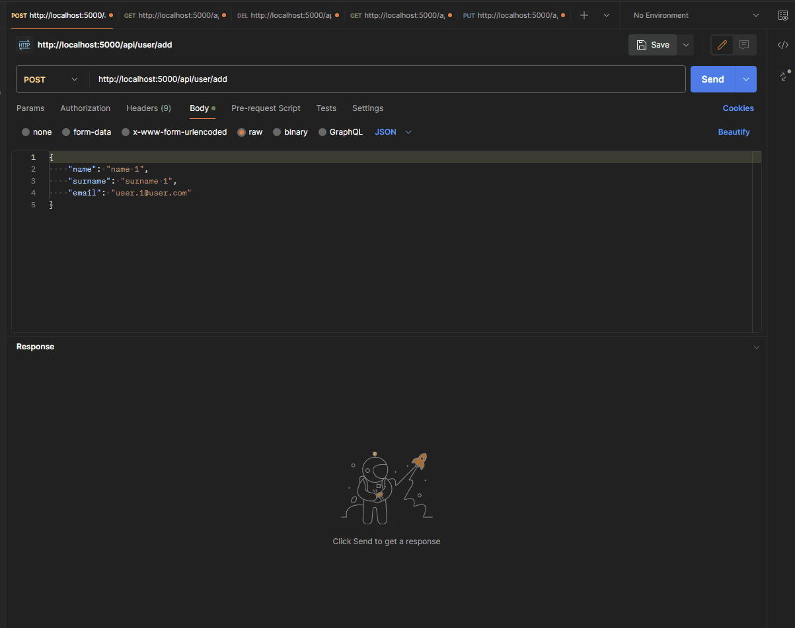

<p align="center">
    
</p>

## Motivation

This project is a code task for Full Stack Developer, this is the part back-end.

<p>
  
</p>

#### Features

- [x] Controller with API REST CRUD for User
- [x] Model with Entity Framework for User
- [x] Newtonsoft for object .NET to JSON vice versa
- [x] Validate any attribute of the DTO Objects
- [x] Tests

#### Commands

| command                           | What it does?                                 |
| --------------------------------- | :-------------------------------------------- |
| `dotnet run --project WebApi`     | Starts the server in dev mode                 |
| `dotnet test`                     | Starts test mode                |

### Local Development

you can setup a local environment with the following commands:

```bash
# Clone repo
git clone https://github.com/SwA91/rindus-backend.git

# Navigate to project directory
cd rindus-backend

# Set up your SQL Server
# Please update the database connection credentials if necessary, it's in WebApi/appsettings.json

# Build and run local dev server
dotnet run --project WebApi
```

#### Disclaimer

The ASP.NET Core name and logos are trademarks of Microsoft.
